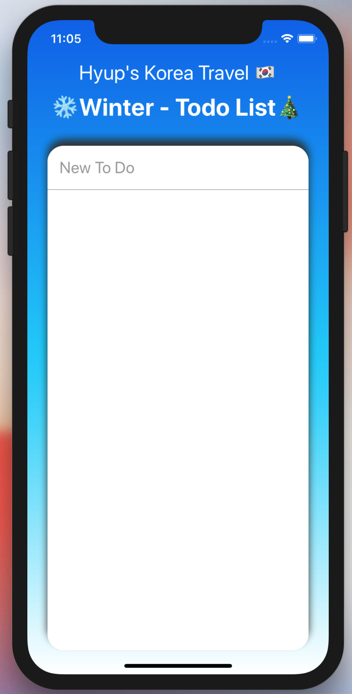
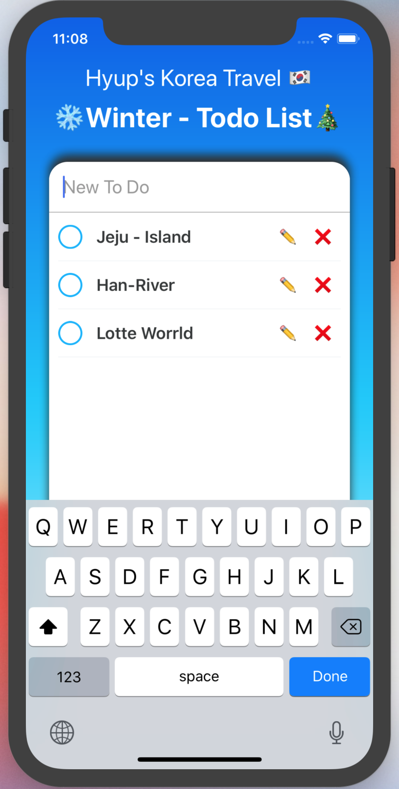
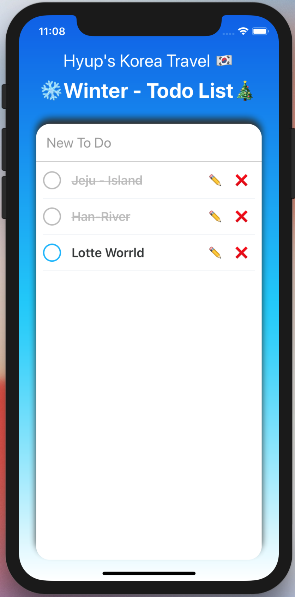
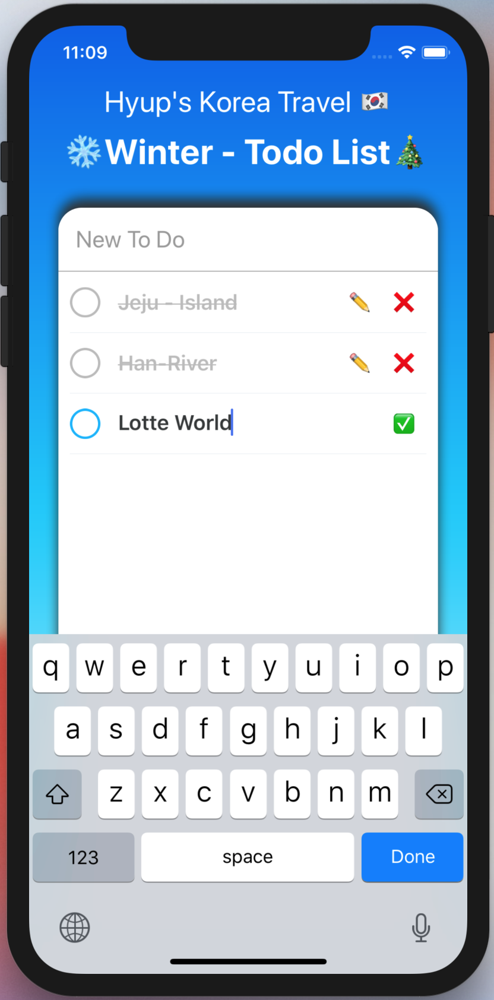

# WinterTODO

2018 Winter is almost here.
Bought my flight ticket to Korea and I am visiting my country in 2 years.

I always imagine what to do, where to visit, and of course what to eat in this winter vacation.
However, I had concern that I might forget all of my plans for Korea when I actually get there.
So I decided to make an IOS app just for my Winter trip to Korea.
WinterTODO saves my plan if I enter, and cross out if I accomplish my plan.

Javascript based, imported React Native,
and used EXPO to run in both simulator and my iPhone xs max.

The first window of WinterTODO

I write down every time I think of new plans.

Well actually, I have been to Jeju-island and Han-river before.
Not going to waste my winter vacation to these places this time.

Mispelled Lotte Worlld, should be Lotte World!

